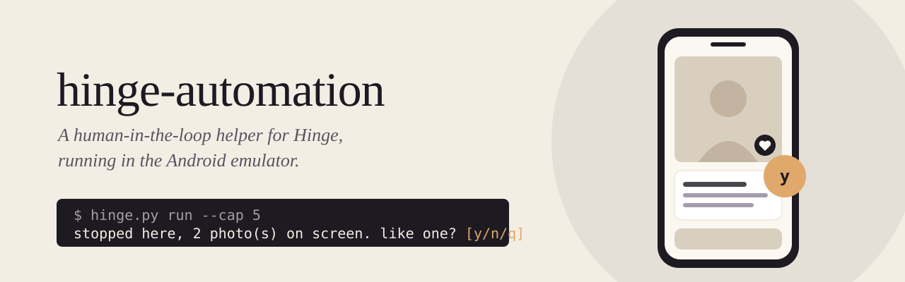

<p align="center">
  
</p>

# hinge-automation

A human-in-the-loop helper for Hinge. Hinge runs in the Android emulator on
your Windows PC. The tool scrolls each profile like a person would, then asks you
before it sends anything. You answer `y`, `n` or `q` for every profile.

```text
> uv run python tools\hinge.py run --cap 5
scanning profile...
stopped here, 2 photo(s) on screen. like one? [y/n/q] y
liking the on-screen photo: 'okay i need the story behind this photo'
sent (1/5 today), saved to C:\src\hinge-automation\people\2026-09-28_231502
scanning profile...
stopped here, 1 photo(s) on screen. like one? [y/n/q] n
scanning profile...
stopped here, 3 photo(s) on screen. like one? [y/n/q] q
```

> [!WARNING]
> Automating Hinge is against its Terms of Service and can get your account
> banned. Use this on your own account, at your own risk. This project is not
> affiliated with Hinge or Match Group. Read [docs/safety.md](docs/safety.md)
> first.

## Features

- **You decide every like.** `run` stops on each profile and waits for your
  answer. Nothing runs unattended, and a daily cap (default 5) holds across runs.
- **Human-like input.** Taps and swipes go to the emulator's touchscreen device
  with random pressure, contact size, curves and timing. Typing has
  per-character rhythm. See [docs/anti-bot.md](docs/anti-bot.md).
- **Reads the screen like you do.** Hinge blocks in-device screenshots, so the
  tool reads the emulator window on your desktop and finds buttons from pixels.
- **Never spends money.** Roses, Boosts and subscriptions are never tapped.
- **Stops instead of guessing.** Every step is checked against a fresh screenshot.
  On an unexpected screen it stops before the next tap.
- **Your own comments.** Likes carry a random line from [`prompts.txt`](prompts.txt),
  or no comment with `--no-comment`.
- **AI openers, optional.** A hotkey sends the profile on screen to Claude or
  OpenAI and puts a tailored opener on your clipboard.
- **MCP server, optional.** Lets Claude Desktop or Claude Code keep your
  preferences, profiles, conversations and drafts in a local SQLite database.

## Supported setup

The tool finds buttons from pixels, so it is tuned to one setup:

- Windows 11
- Android Studio emulator, **Medium Phone** (1080x2400), **API 35 Google Play** image
- Hinge 10.4.0, English, light theme
- Python 3.11+ with [uv](https://docs.astral.sh/uv/); Node.js 22.5+ for the MCP server

Other screens or Hinge versions may need re-tuning. See
[docs/getting-started.md](docs/getting-started.md).

## Quick start

```powershell
git clone https://github.com/CandyButcher27/hinge-automation.git
cd hinge-automation
pip install uv
uv sync

.\run-hinge.ps1            # boot the emulator (create the AVD in Android Studio first)
.\run-hinge.ps1 -Install   # first time: install Hinge from the Play Store, then sign in

uv run python tools\hinge.py run --cap 1
```

Keep the emulator window visible and uncovered while the tool runs.
Full steps are in [docs/getting-started.md](docs/getting-started.md).

## Usage

```powershell
uv run python tools\hinge.py run                # scroll a random depth, like a photo on screen
uv run python tools\hinge.py run --full         # scan the whole profile, like the first, second or last photo
uv run python tools\hinge.py run --no-comment   # like without a message
uv run python tools\hinge.py run --cap 3        # at most 3 likes today
```

Each sent like saves the profile frames and a short record under `people/`,
which is gitignored. Details: [docs/usage.md](docs/usage.md).

## Repository layout

```
.
├── tools/              hinge.py (emulator driver), heart.png, tests
├── capture/            hotkey: screenshot to AI opener on the clipboard
├── dating-assistant/   MCP server (TypeScript) over the shared SQLite database
├── docs/               documentation
├── prompts.txt         comment pool for likes
├── run-hinge.ps1       emulator launcher
└── people/             local records of sent likes (gitignored)
```

## Documentation

| Page | Contents |
| --- | --- |
| [Getting started](docs/getting-started.md) | Supported setup, install, first run |
| [Usage](docs/usage.md) | Modes, flags, `prompts.txt`, records, low-level commands |
| [Safety](docs/safety.md) | What the tool will and will not do; other people's data |
| [Anti-bot measures](docs/anti-bot.md) | How input and pacing are made human-like, and their limits |
| [Architecture](docs/architecture.md) | Screen reading, button detection, input path |
| [Capture tool](docs/capture.md) | AI opener hotkey |
| [MCP server](docs/mcp-server.md) | Claude tools for profiles, preferences and drafts |
| [Troubleshooting](docs/troubleshooting.md) | Error messages and emulator fixes |
| [Contributing](docs/contributing.md) | Tests, rules, re-tuning after a Hinge update |

## Tests

```powershell
uv run pytest capture tools
cd dating-assistant; npm test
```

No test touches the network, a model or the emulator.

## License

[MIT](LICENSE)
